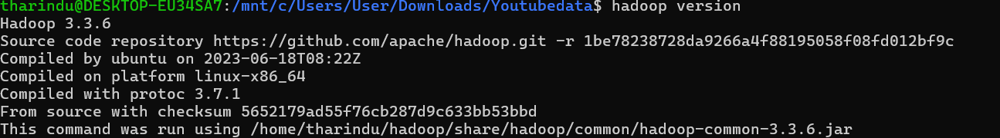

# YouTube Data Analysis using Hadoop MapReduce

**Module:** Cloud Computing (EE7222/EC7204)  
**University:** University of Ruhuna - Faculty of Engineering

## 📌 Project Overview

This project implements a custom MapReduce job to analyze the **Trending YouTube Video Statistics** dataset. The primary goal is to determine **"Trending Category Popularity by Region"** by aggregating total views for specific video categories across different geographic regions (US, GB, CA, etc.).

## 📊 Dataset Information

- **Source:** [Kaggle - Trending YouTube Video Statistics](https://www.kaggle.com/datasets/jawadaahmed/trending-youtube-video-statistics)
- **Files:** Multi-region CSV files (e.g., `USvideos.csv`, `GBvideos.csv`).
- **Data Points:** Approximately 100,000+ rows including views, likes, and comment counts.

## ⚙️ Architecture

The project utilizes the Hadoop MapReduce framework to process data in parallel:

### 1. Trending Category Popularity

- **Mapper (`CategoryPopularityMapper.java`)**:
  - Reads the CSV input line-by-line.
  - Extracts the `category_id` and `views`.
  - Identifies the **Region** by parsing the input file name using `FileSplit`.
  - Emits a composite key: `(Region + CategoryID)` and the value `(Views)`.
- **Shuffle & Sort**:
  - Hadoop groups all view counts belonging to the same Region-Category pair.
- **Reducer (`CategoryPopularityReducer.java`)**:
  - Aggregates the total view count for each key.
  - Emits the final total popularity metrics.

### 2. Average Regional Engagement

- **Mapper (`EngagementMapper.java`)**:
  - Reads the CSV and identifies the **Region** via `FileSplit`.
  - Extracts `views`, `likes`, and `comment_count`.
  - Calculates a per-video engagement score: `(likes + comments) / views`.
  - Emits the **Region** as the key and the **Engagement Score** as the value.
- **Shuffle & Sort**:
  - Hadoop groups all individual engagement scores belonging to the same Region.
- **Reducer (`EngagementReducer.java`)**:
  - Iterates through the scores for each region to calculate the arithmetic mean.
  - Emits the **Region** and the final **Average Engagement Score**.

### 3. Top 3 Highly Engaged Videos

- **Mapper (`TopEngagementMapper.java`)**:
  - Parses the CSV and identifies the **Region** via `FileSplit`.
  - Extracts the video `title` and calculates its specific engagement score.
  - Emits the **Region** as the key and `(title | engagement)` as the value.
- **Shuffle & Sort**:
  - Hadoop groups all video titles and scores for each specific Region.
- **Reducer (`TopEngagementReducer.java`)**:
  - Stores the videos for each region in an internal list and sorts them by score.
  - Identifies the top 3 highest-ranking records.
  - Emits the **Region** and the **Top 3** video titles and scores.

## 🚀 Execution Steps

### 1. Environment Setup

- **Hadoop Version**: Ensure **Hadoop 3.x** is installed.
  
  _(To get this, run: `hadoop version`)_

- **Start Services**: Run the startup scripts to initialize HDFS and YARN.
  ```bash
  start-dfs.sh
  start-yarn.sh
  ```

### 2. Prepare HDFS

```bash
# Create input directory in HDFS
hdfs dfs -mkdir /youtube

# Upload dataset CSV files to HDFS
hdfs dfs -put *.csv /youtube

# Compile the Java classes
javac -classpath `hadoop classpath` -d . *.java

# Create the JAR file
jar -cvf youtube.jar *.class
# Execute the MapReduce jobs
hadoop jar youtube.jar EngagementDriver
hadoop jar youtube.jar TopEngagementDriver
hadoop jar youtube.jar CategoryPopularityDriver

# View the output stored in HDFS
 hdfs dfs -cat /output_engagement_country/part-r-00000
hdfs dfs -cat /output_top3/part-r-00000
hdfs dfs -cat /output_CategoryPopularity/part-r-00000
```
